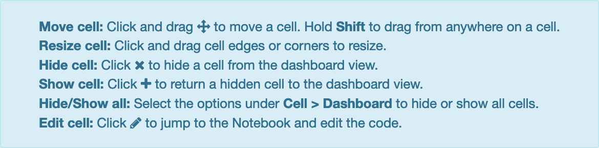

Create dashboard layouts
========================

You can use a normal notebook with markdown and code cells. When you run the
cells, text, charts, widgets, etc. are generated. Then you can choose in the
:menuselection:`Dashboard View` either :menuselection:`Grid Layout` or
:menuselection:`Report Layout`:

.. image:: dashboard-view.png
   :scale: 53%
   :alt: Dashboard view options

With the :menuselection:`Grid Layout` you can change the size of the cells in
the grid and move them. You can also use :menuselection:`Cell --> Dashboard`:

.. image:: dashboard-cell-menu.png
   :scale: 53%
   :alt: Cell menu with dashboard options

In the :menuselection:`Report Layout` you can show or hide cells.

In both layouts you can click on :menuselection:`MORE INFO` to get additional
information:

With :menuselection:`Dashboard Preview` you get a preview, for example for the
:doc:`matplotlib-example`:

.. image:: dashboard-matplotlib-example.png
   :scale: 53%
   :alt: Dashboard with matplotlib example

:menuselection:`View --> Notebook` brings you back to the notebook editor.
