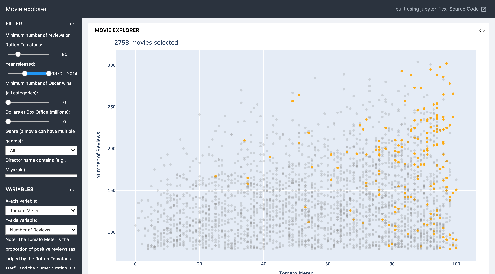
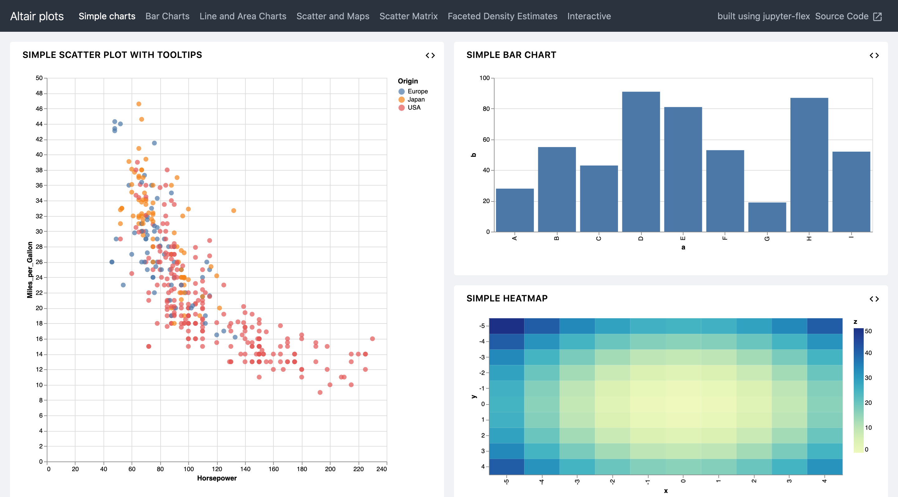

jupyter-flex
============

Jupyter extension that turns notebooks into dashboards:

* uses Markdown headers and Jupyter notebook cell tags to define the layout and
  components of the dashboard
* flexible and easy way to define row- and column-oriented layouts
* uses :doc:`/nbconvert` for static reports
* uses :doc:`../voila/index` for dynamic applications with a Jupyter
  :doc:`kernel </kernels/index>`
* :doc:`/ipywidgets/index` support

.. seealso::
   * `Docs <https://jupyter-flex.danielfrg.com>`_
   * `GitHub <https://github.com/danielfrg/jupyter-flex>`_

Examples
--------

.. figure:: data-scoring.png
   :alt: NBA scoring
   :target: https://jupyter-flex.danielfrg.com/examples/nba-scoring.html

Installation
------------

.. code-block:: console

    $ pipenv install jupyter-flex
