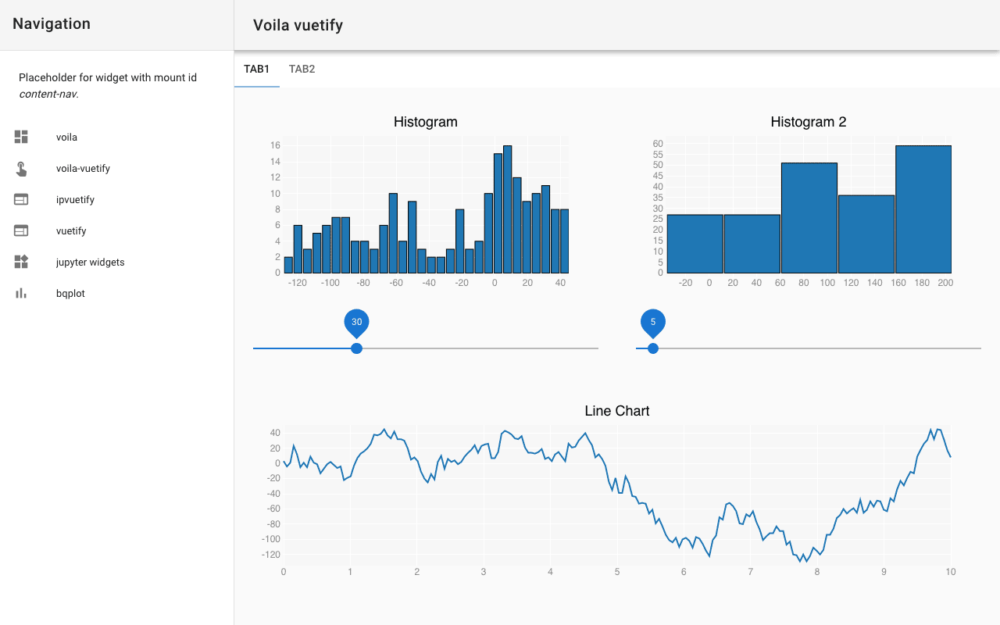
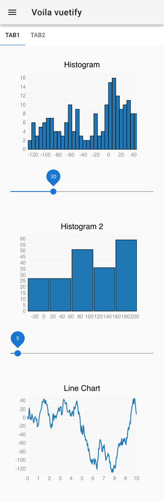

Templating
==========

.. _voila-gridstack:

Voilà gridstack
---------------

`gridstack.js <https://gridstackjs.com/>`_ is a jQuery plugin for widget layouts.
This enables multi-column drag and drop grids and customizable layouts suitable
for `Bootstrap v3 <https://getbootstrap.com/docs/3.4/>`_. It also works with
`knockout.js <https://knockoutjs.com/>`_ and touch devices.

The Gridstack-Voilà template uses the metadata of the notebook cells to design
the layout of the notebook. It should support the entire specification for the
deprecated `Jupyter Dashboards Layout Extension
<https://jupyter-dashboards-layout.readthedocs.io/en/latest/>`_.

.. image:: voila-gridstack.png
   :scale: 53%
   :alt: Example for Voilà gridstack

voila-material
--------------

`voila-material <https://github.com/voila-dashboards/voila-material>`_ is a
template for using Voilà with the `Material Design Component Framework
<https://m3.material.io>`_.

Installation
~~~~~~~~~~~~

.. code-block:: console

   $ uv add voila-material

Usage
~~~~~

You can use ``voila-material`` with :samp:`voila {MY_NOTEBOOK}.ipynb
--template=material` or for the dark theme with :samp:`voila
{MY_NOTEBOOK}.ipynb --template=material --theme=dark`.

voila-vuetify
-------------

`voila-vuetify <https://github.com/voila-dashboards/voila-vuetify>`_ is a
template for using Voilà with `Vuetify.js <https://vuetifyjs.com/>`_.

Installation
~~~~~~~~~~~~

.. code-block:: console

    $ uv add bqplot ipyvuetify voila-vuetify

Usage
~~~~~

To use ``voila-vuetify`` in a notebook, you first have to import ``ipyvuetify``:

.. code-block:: python

    import ipyvuetify as v

Then you can create a layout, for example with:

.. code-block:: python

    v.Tabs(
        _metadata={"mount_id": "content-main"},
        children=[
            v.Tab(children=["Tab1"]),
            v.Tab(children=["Tab2"]),
            v.TabItem(
                children=[
                    v.Layout(
                        row=True,
                        wrap=True,
                        align_center=True,
                        children=[
                            v.Flex(
                                xs12=True,
                                lg6=True,
                                xl4=True,
                                children=[fig, slider],
                            ),
                            v.Flex(
                                xs12=True,
                                lg6=True,
                                xl4=True,
                                children=[figHist2, sliderHist2],
                            ),
                            v.Flex(xs12=True, xl4=True, children=[fig2]),
                        ],
                    )
                ]
            ),
            v.TabItem(children=[v.Container(children=["Lorum ipsum"])]),
        ],
    )

You can use :doc:`bqplot_vuetify_example` with:

.. code-block:: console

    $ uv run voila --template vuetify-default bqplot_vuetify_example.ipynb

Then your standard browser will open the URL ``http://localhost:8866/`` and show
you the plots in Responsive Material Design.

Example for Voilà-vuetify with the monitor resolution of a laptop MDPI screen:

Example for Voilà-vuetify with the monitor resolution of an iPhone X:

voila-reveal
------------

`voila-reveal <https://github.com/voila-dashboards/voila-reveal>`_ is a template
for slideshows based on `RevealJS <https://revealjs.com/>`_.

Installation
~~~~~~~~~~~~

.. code-block:: console

    $ uv add voila-reveal

Usage
~~~~~

You can use the template with:

.. code-block:: console

    $ uv run voila --template=reveal reveal.ipynb

Additional options can be used to override the default settings, for example to
change the default value for transition ``Fade`` to ``Zoom`` with:

.. code-block:: console

    $ uv run voila --template=reveal --VoilaConfiguration.resources="{'reveal': {'transition': 'zoom'}}" reveal.ipynb

If configuration options are to be saved permanently, a  ``conf.json`` file can
be created in ``share/jupyter/voila/templates/reveal/``:

.. code-block:: javascript

    {
      "traitlet_configuration": {
        "resources": {
          "reveal": {
            "scroll": false,
            "theme": "simple",
            "transition": "zoom"
          }
        }
      }
    }

You can then turn your notebook into a slideshow in :menuselection:`View -->
Cell Toolbar --> Slideshow`. In a cell toolbar you can choose between

Slide
    left to right
Sub-Slide
    top to bottom
Fragment
    stops inside a slide
Notes
    Speaker notes opened in a new window when the presenter press the ``t`` key

If you want to publish your slideshow on `binder <https://mybinder.org/>`_, you
must write the following tag in the metadata of the notebook in
:menuselection:`Edit --> Edit Notebook Metadata`:

.. code-block:: javascript

    "rise": {
        "autolaunch": true
    }

You can also use the `chalkboard reveal plugin
<https://github.com/rajgoel/reveal.js-plugins/tree/master/chalkboard>`_ in the
metadata of the notebook:

.. code-block:: javascript

    "rise": {
      "enable_chalkboard": true
    }

Create your own templates
-------------------------

A Voilà template is a folder that is located in the virtual environment at
``share/jupyter/voila/templates`` and for example, contains the following:

.. code-block:: console

    .venv/share/virtualenvs/jupyter-tutorial--q5BvmfG/share/jupyter/voila/templates/mytheme
    ├── conf.json
    ├── nbconvert_templates
    │   └── voila.tpl
    ├── static
    │   ├── mytheme.js
    │   └── mytheme.css
    └── templates
        ├── 404.html
        ├── browser-open.html
        ├── error.html
        ├── page.html
        └── tree.html

``conf.json``
    Configuration file that for example refers to the basic template:

    .. code-block:: json

        {"base_template": "default"}

``nbconvert_templates``
    Custom templates for :doc:`/nbconvert`.
``static``
    Directory for static files.
``templates``
    Custom tornado templates.

Cookiecutter template for Voilà
~~~~~~~~~~~~~~~~~~~~~~~~~~~~~~~

`voila-template-cookiecutter
<https://github.com/voila-dashboards/voila-template-cookiecutter>`_ is a
:doc:`Cookiecutter <python-basics:packs/templating/features>` template that can
help you get started.

Customise Voila with hooks
--------------------------

Voilà offers hooks that allow you to customise the behaviour to your specific
needs. These hooks allow you to include custom functions at specific points
during the execution of Voilà, giving you control over the execution of
notebooks and the configuration of the frontend.

Voilà currently supports the following hooks:

``prelaunch_hook``
    Access and modify the Tornado request and notebook before execution to check
    for authentication cookies, access request header details or modify the
    notebook before rendering for example:

    .. blacken-docs:off

    .. code-block:: python

       def prelaunch_hook(req: tornado.web.RequestHandler,
                notebook: nbformat.NotebookNode,
                cwd: str) -> Optional[nbformat.NotebookNode]:

    .. blacken-docs:on

    ``req``
        refers to the Tornado RequestHandler, which you can use to check
        parameters, headers and so on.
    ``notebook``
        refers to ``NotebookNode``, which you can change, for example to inject
        cells or make other changes at notebook level.
    ``cwd``
        is the current working directory if you want to change something on the
        hard disc.

    The return value of your hook function can be either ``None`` or a
    ``NotebookNode``.

``page_config_hook``
    adjusts the ``page_config`` object that controls the configuration of the
    Voilà frontend. Frontend settings such as the URLs for static assets or
    other configuration parameters can be changed in this way.

    The standard ``page_config_hook`` looks like this:

    .. code-block:: javascript

       page_config = {
         "appVersion": __version__,
         "appUrl": "voila/",
         "themesUrl": "/voila/api/themes",
         "baseUrl": base_url,
         "terminalsAvailable": False,
         "fullStaticUrl": url_path_join(base_url, "voila/static"),
         "fullLabextensionsUrl": url_path_join(base_url, "voila/labextensions"),
         "extensionConfig": voila_configuration.extension_config,
       }

There are two ways to add the hook function to Voilà:

* a :file:`voila.py` configuration file in the directory where you start Voilà

  .. code-block:: python

     def prelaunch_hook_function(req, notebook, cwd):
         """Add your prelaunch hook heere"""
         return notebook

     def page_config_hook_function(current_page_config, **kwargs):
         """Modify the current_page_config"""
         return new_page_config

     c.VoilaConfiguration.prelaunch_hook = hook_function
     c.VoilaConfiguration.page_config_hook = page_config_hook

* a Python script that starts Voilà, for example

  .. code-block:: python

     def parameterize_with_papermill(req, notebook, cwd):
         import tornado

         # Grab parameters
         parameters = req.get_argument("parameters", {})

         # try to convert to dict if not e.g. string/unicode
         if not isinstance(parameters, dict):
             try:
                 parameters = tornado.escape.json_decode(parameters)
             except ValueError:
                 parameters = None

         # if passed and a dict, use papermill to inject parameters
         if parameters and isinstance(parameters, dict):
             from papermill.parameterize import parameterize_notebook

             # setup for papermill
             # these two blocks are done to avoid triggering errors i
             # papermill’s notebook loading logic
             for cell in notebook.cells:
                 if "tags" not in cell.metadata:
                     cell.metadata.tags = []
                 if "papermill" not in notebook.metadata:
                     notebook.metadata.papermill = {}

             # Parameterize with papermill
             return parameterize_notebook(notebook, parameters)

     def page_config_hook(
         current_page_config: Dict[str, Any],
         base_url: str,
         settings: Dict[str, Any],
         log: Logger,
         voila_configuration: VoilaConfiguration,
         notebook_path: str,
     ):
         page_config["fullLabextensionsUrl"] = "/custom/labextensions_url"
         return page_config

You can use both hooks at the same time by adding the following to your Voilà
app:

.. code-block:: python

   from voila.app import Voila
   from voila.config import VoilaConfiguration

   config = VoilaConfiguration()
   config.prelaunch_hook = parameterize_with_papermill
   config.page_config_hook = page_config_hook
   app = Voila()
   app.voila_configuration = config

   app.start()
