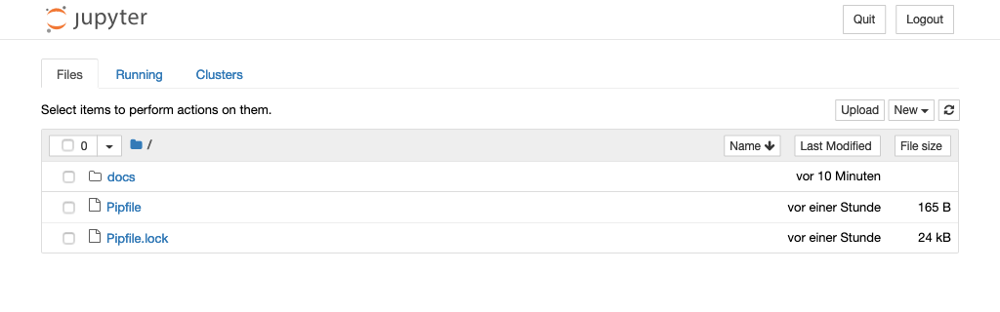

Jupyter Notebook installieren
=============================

Pipenv installieren
-------------------

:term:`pipenv` ist ein Abhängigkeitsmanager für Python-Projekte. Er nutzt
:term:`Pip` zum Installieren von Python-Paketen, er vereinfacht jedoch die
Verwaltung von Abhängigkeiten. Pip kann zum Installieren von Pipenv verwendet
werden, es sollte jedoch das ``--user``-Flag verwendet werden, damit es nur
für diesen Nutzer bereitsteht. Dadurch soll verhindert werden, dass
versehentlich systemweite Pakete überschrieben werden:

.. code-block:: console

    $ pip3 install --user pipenv
      Downloading pipenv-2018.7.1-py3-none-any.whl (5.0MB): 5.0MB downloaded
    Requirement already satisfied (use --upgrade to upgrade): virtualenv in /usr/lib/python3/dist-packages (from pipenv)
    Installing collected packages: pipenv, certifi, pip, setuptools, virtualenv-clone
    …
    Successfully installed pipenv certifi pip setuptools virtualenv-clone
    Cleaning up...

.. note::
    
   Wenn pipenv nach der Installation nicht in der Shell verfügbar ist, muss
   ggf. das ``USER_BASE/bin``-Verzeichnis in ``PATH`` angegeben werden. 

   * Unter Linux und MacOS lässt sich ``USER_BASE`` ermitteln mit:

     .. code-block:: console

        $ python3 -m site --user-base
        /home/veit/.local

     Anschließend muss noch das ``bin``-Verzeichnis angehängt und zu ``PATH``
     hinzugefügt werden. Alternativ kann ``PATH`` dauerhaft gesetzt werden, indem
     ``~/.profile`` oder ``~/.bash_profile`` geändert werden, in meinem Fall also:

     .. code-block:: bash

        export PATH=/home/veit/.local/bin:$PATH

   * Unter Windows kann das Verzeichnis ermittelt werden mit
     ``py -m site --user-site`` und anschließend ``site-packages`` durch
     ``Scripts`` ersetzt werden. Dies ergibt dann z.B.:

     .. code-block:: console

        C:\Users\veit\AppData\Roaming\Python36\Scripts

     Um dauerhaft zur Verfügung zu stehen, kann dieser Pfad unter ``PATH``
     im Control Panel eingetragen werden.

Weitere Informationen zur nutzerspezifischen Installation findet ihr in `User
Installs <https://pip.readthedocs.io/en/latest/user_guide.html#user-installs>`_.

Virtuelle Umgebung mit ``jupyter`` erstellen
--------------------------------------------

:term:`Virtuelle Python-Umgebungen <Virtuelle Umgebung>` ermöglichen die
Installation von Python-Paketen an einem isolierten Ort für eine bestimmte
Anwendung, anstatt sie global zu installieren. Ihr habt also eure eigenen
Installationsverzeichnisse und teilt keine Bibliotheken mit anderen
virtuellen Umgebungen:

.. code-block:: console

    $ mkdir myproject
    $ cd !$
    cd myproject
    $ $ pipenv install jupyter
    Creating a virtualenv for this project..
    ...
    Virtualenv location: /home/veit/.local/share/virtualenvs/myproject-9TTuTZjx
    Creating a Pipfile for this project...
    Installing jupyter...
    ...

``jupyter notebook`` starten
----------------------------

.. code-block:: console

    $ pipenv run jupyter notebook
    ...
    [I 12:46:53.852 NotebookApp] The Jupyter Notebook is running at:
    [I 12:46:53.852 NotebookApp] http://localhost:8888/?token=53abd45a3002329de77f66886e4ca02539d664c2f5e6072e
    [I 12:46:53.852 NotebookApp] Use Control-C to stop this server and shut down all kernels (twice to skip confirmation).
    [C 12:46:53.858 NotebookApp] 
        
        To access the notebook, open this file in a browser:
            file:///Users/veit/Library/Jupyter/runtime/nbserver-7372-open.html
        Or copy and paste one of these URLs:
            http://localhost:8888/?token=53abd45a3002329de77f66886e4ca02539d664c2f5e6072e

Daraufhin wird euer Standardwebbrowser mit dieser URL geöffnet.

Wenn das Notebook in eurem Browser geöffnet wird, wird das Notebook-Dashboard
mit einer Liste der Notebooks, Dateien und Unterverzeichnisse in dem Verzeichnis
angezeigt, in dem der Notebook-Server gestartet wurde. In den meisten Fällen möchtet
ihr einen Notebook-Server in eurem Projektverzeichnis starten.

