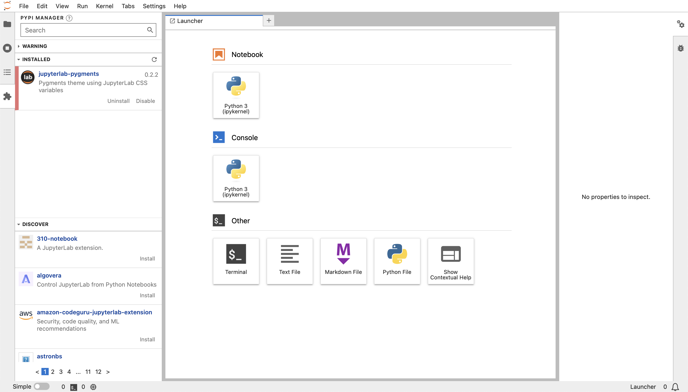

Install JupyterLab
==================

Creating a virtual environment with JupyterLab
----------------------------------------------

.. code-block:: console

   $ python3 -m venv myproject
   $ cd myproject
   $ . bin/activate
   $ python -m pip install jupyterlab

Start JupyterLab
----------------

.. code-block:: console

   $ jupyter lab
   [I 2023-06-16 13:01:43.205 ServerApp] Package jupyterlab took 0.0000s to import
   ...
       To access the server, open this file in a browser:
           file:///Users/veit/Library/Jupyter/runtime/jpserver-48904-open.html
       Or copy and paste one of these URLs:
           http://localhost:8888/lab?token=72d33027f130e602f43ef0cdfbff7471c8406ffafd94f075
           http://127.0.0.1:8888/lab?token=72d33027f130e602f43ef0cdfbff7471c8406ffafd94f075

Your default web browser will then open with this URL.

Localisation
------------

Since version 3.0, JupyterLab offers the possibility to set the display language
of the interface. To do this, the appropriate language packages must be
installed, for example:

.. code-block:: console

   $ python -m pip install jupyterlab-language-pack-de-DE

In the `language-packs <https://github.com/jupyterlab/language-packs/>`_
repository you will find a list of the available language packs.

Then you can select the newly installed language in :menuselection:`Settings -->
Language`.
