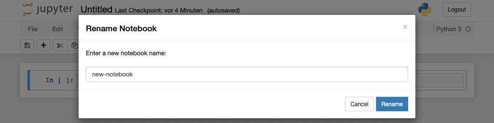

Create notebook
===============

After the notebook server has started, we can create our first notebook.

Create a notebook
-----------------

In your standard browser you should see the notebook dashboard with the *New*
menu on the right. All notebook kernels are listed in this menu, but initially
probably only *Python 3*.

After you have selected :menuselection:`New --> Python 3`, a new notebook
``Untitled.ipynb`` will be created and displayed in a new tab:

.. image:: initial-notebook.png

Renaming the notebook
---------------------

Next you should rename this notebook by clicking on the title *Untitled*:

The notebook user interface
---------------------------

There are two important terms used to describe Jupyter Notebooks: *cell* and
*kernel*:

.. glossary::

   *Notebook kernel*
       *Computational engine*  that executes the code contained in a notebook.

   *Notebook cell*
       Container for text to be displayed in a notebook or for code to be
       executed by the notebook’s kernel.

       *Code*
           contains code to be executed in the kernel, and the output which is
           shown below.

           In front of the code cells are brackets that indicate the order in
           which the code was executed.

           ``In [ ]:``
            indicates that the code has not yet been executed.
           ``In [*]:``
            indicates that the execution has not yet been completed.

            .. warning::
                The output of cells can be used in other cells later. Therefore,
                the result depends on the order. If you choose a different order
                than the one from top to bottom, you may get different results
                later when you e.g. select :menuselection:`Cell --> Run All`.

       *Markdown*
           contains text formatted with `Markdown
           <https://daringfireball.net/projects/markdown/syntax>`_, which is
           interpreted as soon as :menuselection:`Run` is pressed.

.. _whats-an-ipynb-file:

What’s an ``ipynb`` file?
-------------------------

This file describes a notebook in
:doc:`python4datascience:data-processing/serialisation-formats/json/index`
format. Each cell and its contents including pictures are listed there along
with some metadata. You can have a look at them if you select the notebook in
the dashboard and then click on :menuselection:`edit`. For example the JSON file
for :file:`my-first-notebook.ipynb` looks like this:

.. code-block:: json

    {
     "cells": [
      {
       "cell_type": "markdown",
       "metadata": {},
       "source": [
        "# My first notebook"
       ]
      },
      {
       "cell_type": "code",
       "execution_count": 1,
       "metadata": {},
       "outputs": [
        {
         "name": "stdout",
         "output_type": "stream",
         "text": [
          "Hello World!\n"
         ]
        }
       ],
       "source": [
        "print('Hello World!')"
       ]
      }
     ],
     "metadata": {
      "kernelspec": {
       "display_name": "Python 3",
       "language": "python",
       "name": "python3"
      },
      "language_info": {
       "codemirror_mode": {
        "name": "ipython",
        "version": 3
       },
       "file_extension": ".py",
       "mimetype": "text/x-python",
       "name": "python",
       "nbconvert_exporter": "python",
       "pygments_lexer": "ipython3",
       "version": "3.7.0"
      }
     },
     "nbformat": 4,
     "nbformat_minor": 2
    }

Save and checkpoints
--------------------

When you click on :menuselection:`Save and Checkpoint`, your :file:`*.ipynb`
file will be saved. But what is the checkpoint all about?

Every time you create a new notebook, a file is also created, which usually
automatically saves your changes every 120 seconds. This checkpoint is usually
located in a hidden directory called :file:`.ipynb_checkpoints/`. This
checkpoint file therefore enables you to restore your unsaved data in the event
of an unexpected problem. You can go back to one of the last checkpoints in
:menuselection:`File --> Revert to Checkpoint`.

Tips and tricks
---------------

#. Give the notebook a title (:samp:`# {MY TITLE}`) and a meaningful foreword to
   describe the content and purpose of the notebook.
#. Create headings and documentation in Markdown cells to structure your
   notebook and explain your workflow steps. It doesn’t matter whether you do
   this for your colleagues or for yourself in the future.
#. Use *Table of Contents (2)* from the :doc:`../nbextensions/list` to
   create a table of contents.
#. Use the notebook extension :doc:`setup <../nbextensions/setup>`.
#. Use snippets from the list of extensions to add more frequently used code
   blocks, for example typical import instructions, easy to insert.
