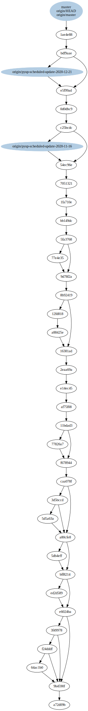

``git-big-picture``
===================

``git-big-picture`` visualises Git repositories as DAGs. The tool comes with
some filters to show only the interesting areas, e.g. the hierarchy of tags and
branches.

Example
-------

Here is the example of this tutorial with merges but without tags:

Installation
------------

You can easily install ``git-big-picture`` with:

.. code-block:: console

    $ pipenv install git-big-picture
    Installing git-big-picture…
    Adding git-big-picture to Pipfile's [packages]…
    ✔ Installation Succeeded
    …

Git-Integration
---------------

You can easily integrate the tool into Git by adding the script
``git-big-picture`` to ``$PATH``. Then you can use it, e.g. with:

.. code-block:: console

    $ git big-picture -h
    Usage: git-big-picture OPTIONS [<repo-directory>]

    Options:
      --version             show program's version number and exit
      -h, --help            show this help message and exit
      --pstats=FILE         run cProfile profiler writing pstats output to FILE
      -d, --debug           activate debug output

      Output Options:
        Options to control output and format

        -f FMT, --format=FMT
                            set output format [svg, png, ps, pdf, ...]
        -g, --graphviz      output lines suitable as input for dot/graphviz
        -G, --no-graphviz   disable dot/graphviz output
        -p, --processed     output the dot processed, binary data
        -P, --no-processed  disable binary output
        -v CMD, --viewer=CMD
                            write image to tempfile and start specified viewer
        -V, --no-viewer     disable starting viewer
        -o FILE, --outfile=FILE
                            write image to specified file
        -O, --no-outfile    disable writing image to file

      Filter Options:
        Options to control commit/ref selection

        -a, --all           include all commits
        -b, --branches      show commits pointed to by branches
        -B, --no-branches   do not show commits pointed to by branches
        -t, --tags          show commits pointed to by tags
        -T, --no-tags       do not show commits pointed to by tags
        -r, --roots         show root commits
        -R, --no-roots      do not show root commits
        -m, --merges        include merge commits
        -M, --no-merges     do not include merge commits
        -i, --bifurcations  include bifurcation commits
        -I, --no-bifurcations
                            do not include bifurcation commits

Configuration
-------------

The standard ``git config`` infrastructure can be used to configure
``git-big-picture``. Most of the command line arguments can be configured in a
``[big-picture]`` section. For example, to configure firefox as a viewer with

.. code-block:: console

    $ git config --global big-picture.viewer firefox

will create the following section in your ``~/.gitconfig`` file:

.. code-block:: ini

    [big-picture]
        viewer = firefox

.. note::
  Please note, however, that this disables other options at the same time. For
  example, you can no longer display the graph with Graphviz:

  .. code-block:: console

    $ git-big-picture -g
    fatal: Options '-g | --graphviz' and '-p | --processed' are incompatible with other output options.

   In this case you must also specify the ``-V`` or ``--no-viewer`` option:

  .. code-block:: console

    $ git-big-picture -g -V
    digraph {
        "c509669a01b156900eed9f1c9f927b6d2f7bb95b"[label="origin/pyup-scheduled-update-2020-11-16", color="/pastel13/2", style=filled];
    …
