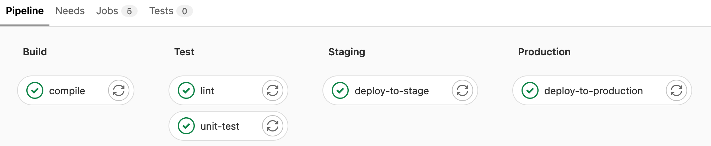

GitLab CI/CD
============

GitLab CI/CD can automatically build, test, deploy and monitor your applications
during iterative code changes. This reduces the risk that you will develop new
code based on buggy previous versions. In the process, little or no human
intervention should be required from the development to its deployment of code
changes.

The three main approaches to this continuous development are:

Continuous Integration
    runs a series of scripts sequentially or in parallel that your application
    automatically builds and tests, for example after each ``git pull`` in a
    :doc:`feature branch <../workflows/feature-branches>`. This is to make it
    less likely that you will introduce bugs into your application.

    If the checks work as expected, you can make a :doc:`merge request
    <merge-requests>`; if the checks fail, you can revert the changes if
    necessary.

    .. seealso::
       * `Continuous integration
         <https://en.wikipedia.org/wiki/Continuous_integration>`_

Continuous Delivery
    goes one step further than Continuous Integration and also continuously
    deploys the application. However, this still requires manual intervention to
    manually deploy the changes to a :ref:`deployment branch
    <deployment-branches>`.

    .. seealso::
       * `Continuous Delivery <https://continuousdelivery.com>`_
       * `Continuous Delivery
         <https://en.wikipedia.org/wiki/Continuous_delivery>`__

Continuous Deployment
    also performs the deployment of the software to the productive
    infrastructure automatically.

Activating CI/CD in a project
-----------------------------

#. Select menuselection:`Menu --> Projects` in the top bar and find your
   project.
#. In the left sidebar, select menuselection:`Settings --> General`.
#. Expand :guilabel:`Visibility, project features, permissions`.
#. In the menuselection:`Repository` section, activate the :guilabel:`CI/CD
   option`.
#. Select :guilabel:`Save changes`.

CI/CD pipelines
---------------

Pipelines are the most important component of Continuous Integration, Delivery
and Deployment.

Pipelines consist of:

Jobs
    define what needs to be done, for example compiling code or testing.

    .. seealso::
       `Jobs <https://docs.gitlab.com/ee/ci/jobs/index.html>`_

Stages
    define when the jobs are to be executed, for example the phase ``test`` to
    be executed after the phase ``build``.

    .. seealso::
       `Stages <https://docs.gitlab.com/ee/ci/yaml/index.html#stages>`_

*Jobs* are executed by so-called `runners
<https://docs.gitlab.com/ee/ci/runners/index.html>`_. Several *jobs* in a
*stage* are executed in parallel, provided there are enough simultaneous runners
available.

If all *jobs* in a *stage* are successful, the pipeline continues with the next
*stage*.

If a *job* in a *stage* fails, the next *stage* is normally not executed and
the pipeline is terminated prematurely.

In general, pipelines are executed automatically and do not require any
intervention once they have been created. However, there are cases where you can
manually intervene in a pipeline.

A typical pipeline may consist of four *stages* that are executed in the
following order:

#. A ``build`` stage with a job called ``compile``.
#. A ``test`` stage with two parallel jobs called ``unit-test`` and ``lint``.
#. A ``staging`` stage with a *job* called ``deploy-to-stage``.
#. A ``production`` stage with a *job* called ``deploy-to-prod``.

The corresponding ``.gitlab-ci.yml`` file could then look like this:

.. code-block:: yaml

    stages:
      - build
      - test
      - staging
      - production

    compile:
      stage: build
      script:
        - echo "Compiling the code..."
        - echo "Compile complete."

    unit-test:
      stage: test
      script:
        - echo "Running unit tests... This will take about 60 seconds."
        - sleep 60
        - echo "Code coverage is 0%"

    lint:
      stage: test
      script:
        - echo "Linting code... This will take about 10 seconds."
        - sleep 10
        - echo "No lint issues found."

    deploy-to-stage:
      stage: stage
      script:
        - echo "Deploying application in staging environment..."
        - echo "Application successfully deployed to staging."

    deploy-to-production:
      stage: production
      script:
        - echo "Deploying application in production environment..."
        - echo "Application successfully deployed to production."

Show pipelines
~~~~~~~~~~~~~~

You can find the current and historical pipeline runs on the
:menuselection:`CI/CD --> Pipelines` page of your project. You can also access
pipelines for a :doc:`merge request <merge-requests>` by navigating to their
:guilabel:`Pipelines` tab. Select a pipeline to open the *Pipeline Details* page
and view the jobs that have been run for that pipeline. From here you can cancel
a running pipeline, retry *jobs* in a failed pipeline or delete a pipeline.

   GitLab CI/CD pipeline

.. seealso::
   * `Customize pipeline configuration
     <https://docs.gitlab.com/ee/ci/yaml/index.html>`_
   * `Scheduled pipelines
     <https://docs.gitlab.com/ee/ci/pipelines/schedules.html>`_
   * `GitLab CI/CD variables
     <https://docs.gitlab.com/ee/ci/variables/index.html>`_
   * `Predefined variables reference
     <https://docs.gitlab.com/ee/ci/variables/predefined_variables.html>`_
