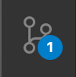

Visual Studio Code
==================

`Visual Studio Code <https://code.visualstudio.com/>`_ can use an existing
:doc:`Git installation <install-config>` to provide the corresponding
functionalities.

Clone
-----

   Source control icon

   If you have not yet opened a repository, you have the option of selecting
   :menuselection:`Open Folder` or :menuselection:`Clone Repository` in the
   :menuselection:`Source Code` view. If you select :menuselection:`Clone
   Repository`, you will be asked for the URL of the repository.

Gutter indicators
-----------------

When you open a Git repository and start making changes, VS Code adds useful
annotations:

* a red triangle indicates where lines have been deleted
* a green bar indicates newly added lines
* a blue bar indicates lines that have been changed.

Commit
------

``git add`` and ``git reset`` can be selected either in the context menu of a
file or by drag & drop. After a ``git commit``, you can enter a commit message
and confirm with :kbd:`Ctrl ⏎` or :kbd:`⌘ ⏎`. If there are already changes in
the stage area, only these will be committed; otherwise you will be asked to
select changes. If necessary, you will receive more specific commit actions in
:menuselection:`Views and More Actions…`

.. note::
    If you have accidentally created your commit in the wrong branch, you can
    undo it with :menuselection:`Git: Undo Last Commit` in the
    :menuselection:`Command Palette` (:kbd:`⇧ ⌘ P`).

The sorce control icon in the activity bar on the left shows you how many
changes you have made in your repository. Selecting the icon will give you a
more detailed overview of your changes. Selecting a single file will show you
the line-by-line text changes. You can also use the editor on the right to make
further changes.

Branches and tags
-----------------

You can create branches and switch to them using :menuselection:`Git: Create
Branch` and :menuselection:`Git: Checkout to` from the :menuselection:`Command
Palette` (:kbd:`⇧ ⌘ P`). When you call :menuselection:`Git: Checkout to`, a
dropdown list appears with all the branches and tags of the repository. You can
also create a new branch here.

Git status bar
--------------

   Status bar

   In the lower left corner you will see the status display with further
   indicators about the state of your repository:

   * the current branch with the possibility to switch to another branch
   * incoming and outgoing commits
   * the menuselection:`Synchronize Changes` action, which first executes ``git
     pull`` and then ``git push``.

Extensions
----------

* `Git Blame
  <https://marketplace.visualstudio.com/items?itemName=waderyan.gitblame>`_
* `Git History
  <https://marketplace.visualstudio.com/items?itemName=donjayamanne.githistory>`_
* `Git Lens
  <https://marketplace.visualstudio.com/items?itemName=eamodio.gitlens>`_
