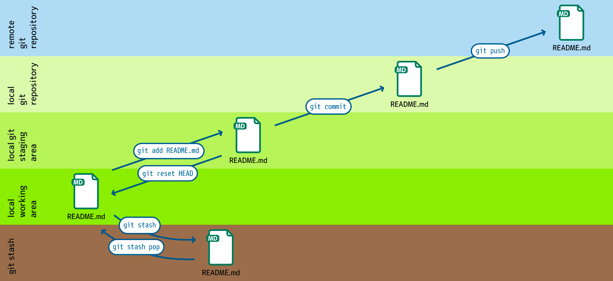

Workspaces
==========

``git add``
    adds files from the working directory to the staging area.
``git reset HEAD``
    restores a file in the work area from the stage area.
``git stash``
    moves files from the workspace to a stash.
``git stash pop``
    brings files from the stash to the work area.
``git push``
    moves files from the staging area to the repository.

    ``git push -u origin master``
        ``-u`` defines the upstream reference for each branch, the arguments are
        then given and no longer have to be specified explicitly.  In our
        example ``master`` in the external repository is referenced.
