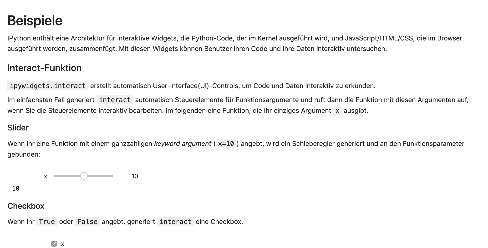
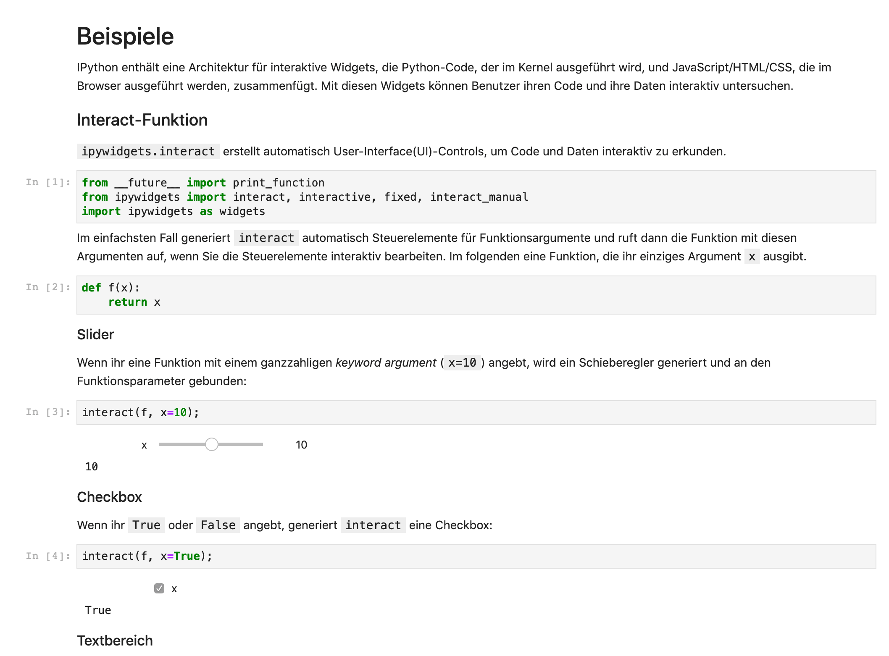

Installation and use
====================

Installation
------------

voilà can be installed with:

.. code-block:: console

   $ pipenv install voila
   Installing voila...
   ...

Start
-----

… as a stand-alone application
~~~~~~~~~~~~~~~~~~~~~~~~~~~~~~

You can check the installation, e.g. with:

.. code-block:: console

   $ pipenv run voila docs/workspace/jupyter/ipywidgets/examples.ipynb
   ...
   [Voila] Voilà is running at:
   http://localhost:8866/

Your standard browser should open and display the ``ipywidget`` examples from
our tutorial:

Alternatively, you can also display a directory with all the notebooks it
contains:

.. code-block:: console

    $ pipenv run voila docs/workspace/jupyter/ipywidgets
    ...

.. image:: voila-example-2.png
   :alt: Voilà example of a directory view

It is also possible to display the source code with:

.. code-block:: console

    $ pipenv run voila --strip_sources=False docs/workspace/jupyter/ipywidgets/examples.ipynb
    ...

.. note::
    Note that the code is only displayed. Voilà does not allow users to edit or
    run the code.

Usually the ``light`` theme is used; however, you can also choose the ``dark``
theme:

.. code-block:: console

    $ pipenv run voila --theme=dark docs/workspace/jupyter/ipywidgets/examples.ipynb
    ...

… as an extension of the Jupyter server
~~~~~~~~~~~~~~~~~~~~~~~~~~~~~~~~~~~~~~~

Alternatively you can start voilà as an extension of the Jupyter server:

.. code-block:: console

    $ pipenv run jupyter notebook
    ...

Then you can call up voilà, e.g. under the URL
``http://localhost:8888/voila``.
