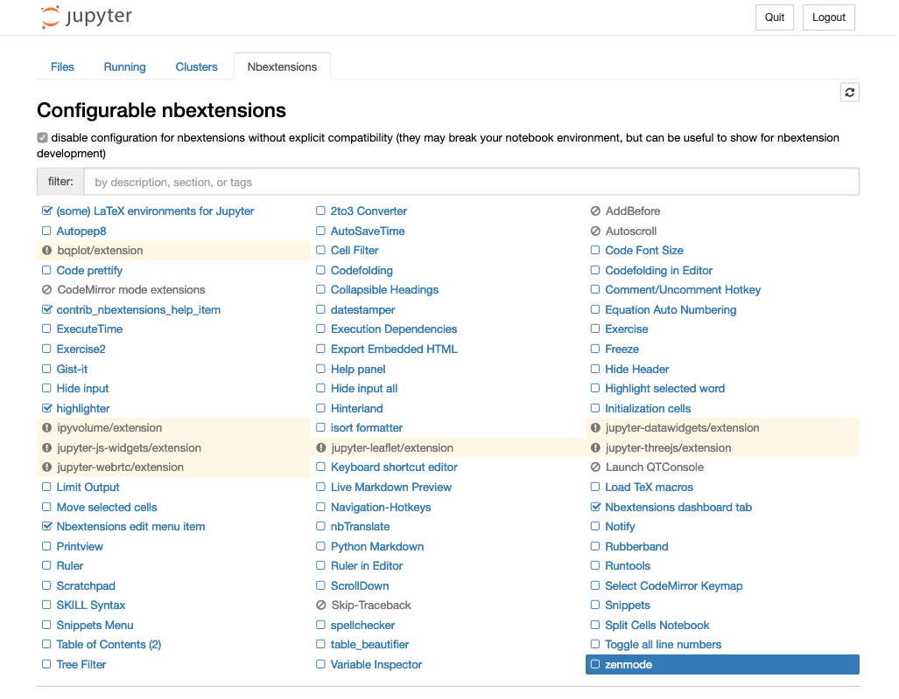

List of extensions
==================

You can activate and configure the notebook extensions by clicking on the
:menuselection:`Nbextensions` tab. There you have access to the extensions,
which can be activated/deactivated via checkboxes. In addition, documentation
and configuration options are displayed for each extension.

Hereinafter I will give a brief overview of some of the notebook extensions.

(some) LaTeX environments for Jupyter notebook
    enables the use of Markdown cells for LaTeX commands and environments. In
    addition, two menus are added: :menuselection:`LaTeX_envs` for quick
    selection of the suitable LaTeX environment and :menuselection:`Some
    configuration options` for further options:

    .. image:: latex-env.png
       :alt: LaTeX environment

    The notebook can then be exported as an HTML or LaTeX document.

    The configuration of the LaTeX environments is done in  ``user_envs.json``
    and for the styles in ``latex_env.css``. Additional environments can be
    added in ``user_envs.json`` or in ``thmsInNb4.js`` (→ `LaTeX-Environments
    doc
    <https://rawgit.com/jfbercher/jupyter_latex_envs/master/src/latex_envs/static/doc/documentation.pdf>`_).

:doc:`jupyter-contrib-nbextensions:nbextensions/code_prettify/README_autopep8`
    formats/beautifies Python code in cells. The extension uses `autopep8
    <https://github.com/hhatto/autopep8>`_ and can therefore only be used with
    a Python kernel.

:doc:`jupyter-contrib-nbextensions:nbextensions/code_prettify/README_code_prettify`
    formats/beautifies code notebook code cells. The current notebook kernel is
    used, which is why the Prettifier package used must be available in this
    kernel. Sample implementations are provided for ipython, R, and Javascript
    kernels.

:doc:`jupyter-contrib-nbextensions:nbextensions/limit_output/readme`
    limits the number of characters that a code cell outputs as text or HTML.
    This also breaks endless loops. You can set the number of characters with
    the ``ConfigManager``:

    .. code-block::

        from notebook.services.config import ConfigManager
        cm = ConfigManager().update('notebook', {'limit_output': 1000})

`Nbextensions edit menu item <https://github.com/Jupyter-contrib/jupyter_nbextensions_configurator>`_
    adds an edit menu to open the configuration page of ``nbextensions``.

:doc:`jupyter-contrib-nbextensions:nbextensions/printview/readme`
    adds an icon to display the print preview of the current notebook in a new
    browser tab.

:doc:`jupyter-contrib-nbextensions:nbextensions/ruler/readme`
    adds a ruler after a certain number of characters. The number of characters
    can be specified with the ``ConfigManager``:

    .. code-block::

        from notebook.services.config import ConfigManager
        ip = get_ipython()
        cm = ConfigManager(parent=ip)
        cm.update('notebook', {"ruler_column": [80]})

:doc:`jupyter-contrib-nbextensions:nbextensions/scratchpad/README`
    adds a note cell to the notebook. In this cell you can run code from the
    current kernel without changing the document.

:doc:`jupyter-contrib-nbextensions:nbextensions/snippets/README`
    adds a configurable menu item to notebooks to insert snippets,
    boilerplate and code examples.

    .. image:: snippets-menu.png
       :alt: Snippets menu

    You can also define your own menu items, see also
    :doc:`jupyter-contrib-nbextensions:nbextensions/snippets/README`.

:doc:`jupyter-contrib-nbextensions:nbextensions/toc2/README`
    makes it possible to collect all headings and display them in a floating
    window, as a sidebar or in a navigation menu.

    If headings shouldn’t be displayed in the table of contents, you can do this
    with:

    .. code-block:: HTML

        ## My title <a class="tocSkip">

    The table of contents can also be exported by specifying a corresponding
    template, e.g.

    .. code-block:: console

        $ jupyter nbconvert mynotebook.ipynb --template toc2

    General documentation on templates can be found in
    :label:`nbconvert:external_exporters`.

:doc:`jupyter-contrib-nbextensions:nbextensions/tree-filter/readme`
    filters in the Jupyter dashboard by file name.

:doc:`jupyter-contrib-nbextensions:nbextensions/code_prettify/README_2to3`
    converts Python2 to Python3 code in a code cell using the `lib2to3
    <https://github.com/python/cpython/tree/3.7/Lib/lib2to3/>`_ library.

:doc:`jupyter-contrib-nbextensions:nbextensions/codefolding/readme`
    enables code folding in code cells.

    .. image:: code-folding.png
       :alt: Codefolding

    Usually code folding is retained when exporting with nbconvert. This can
    either be changed in ``jupyter_nbconvert_config.py`` with:

    .. code-block:: python

        c.CodeFoldingPreprocessor.remove_folded_code=True = True

    or on the command line with:

    .. code-block:: console

        $ jupyter nbconvert --to html --CodeFoldingPreprocessor.remove_folded_code=True mynotebook.ipynb

:doc:`jupyter-contrib-nbextensions:nbextensions/collapsible_headings/readme`
    enables notebooks to have collapsible sections separated by headings.

:doc:`jupyter-contrib-nbextensions:nbextensions/datestamper/readme`
    inserts the current time and date in one cell.

:doc:`jupyter-contrib-nbextensions:nbextensions/hinterland/README`
    enables autocompletion.

:doc:`jupyter-contrib-nbextensions:nbextensions/varInspector/README`
    collects all defined variables and displays them in a floating window.

:doc:`jupyter-contrib-nbextensions:nbextensions/load_tex_macros/readme`
    automatically loads a series of latex commands from the ``latexdefs.tex``
    file when a notebook is opened.
